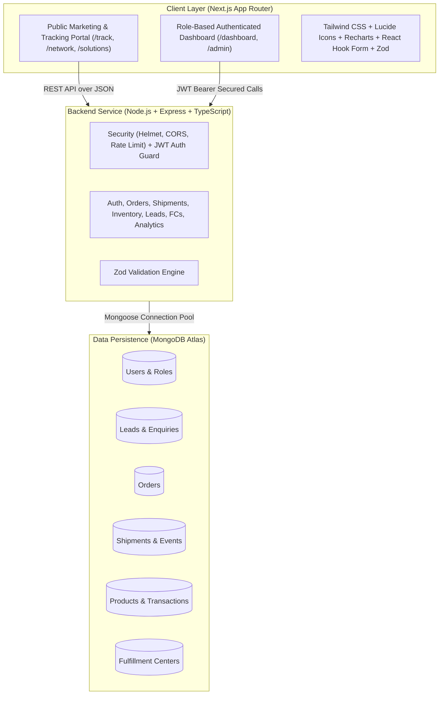

# WareIQ Interactive Fulfillment & Logistics Platform

> **Live Institute Client Project**  
> **Developer**: Manoj Arja  
> **Track**: Full Stack Web Development — MERN Cohort  
> **Client**: WareIQ (eCommerce Fulfillment & Logistics Tech)  
> **Allocation Date**: 28 September 2026 | **Production Deadline**: 05 October 2026  
> **Disclaimer**: *This is an educational/client-project demonstration built using publicly available WareIQ information and clearly labeled demo operational data. It is not the private WareIQ production platform.*

---

## 1. Project Overview & Business Domain

**WareIQ** ([https://wareiq.com/](https://wareiq.com/)) is India’s modern eCommerce fulfillment and supply chain technology platform providing Amazon-grade Same-Day & Next-Day delivery for fast-growing D2C, B2B, and Omnichannel brands.

This application redevelops the WareIQ experience into a full-stack, enterprise-grade web application featuring two seamlessly connected environments:
1. **Public Corporate Fulfillment Portal**: Modern, responsive corporate portal presenting WareIQ’s real business solutions, pan-India fulfillment center network, shipping engine capabilities, industry verticals, public order tracking, and a 3-step enterprise demo inquiry form.
2. **Authenticated Operations & Admin Management Control Tower**: High-density interactive operations dashboard enabling merchants and operations teams to monitor live shipments, manage multi-channel orders, track inventory stock with reorder alerts, execute audit-logged stock adjustments, and manage incoming CRM leads.

---

## 2. Key Features & Capabilities

### 🌐 Public Experience
- **Enterprise Homepage**: Clear value propositions, factual performance metrics (99.8% SLA dispatch, 4 PM same-day cutoff, 35% RTO reduction), operating workflows, and interactive tracking quick-search.
- **Modular Solutions Pages**: Specialized portals for **D2C Fulfillment**, **Marketplace Flex Prep (Amazon/Flipkart)**, **Quick Commerce Dark Store Staging (Blinkit/Zepto)**, **B2B Modern Trade**, **WareIQ Shipping Engine**, and **Seller of Record (SOR)**.
- **Interactive Fulfillment Network Explorer (`/network`)**: Searchable and filterable map/card interface showcasing strategic Tier 1 & Tier 2 fulfillment centers across North, West, South, and East zones with live capacity utilization indicators.
- **Real-Time Consignment Tracking Portal (`/track`)**: Search by AWB or Order ID with visual timeline checkpoints, carrier routing information, delivery ETAs, and active Non-Delivery Report (NDR) alert banners.
- **Multi-Step Enterprise Demo Form (`/contact`)**: 3-step wizard with Zod validation capturing company scale, monthly order volume, and fulfillment challenges directly into MongoDB.

### 📊 Authenticated Dashboard (`/dashboard`)
- **Executive Operations KPI Bar**: Total Orders, In-Transit consignments, Delivered (SLA met), NDR active exceptions, RTO returns, and low stock warnings.
- **Order & Shipment Management (`/dashboard/orders`)**: Complete orders listing with multi-attribute filtering (channel, status, date), global search, pagination, and demo consignment injection modal.
- **Inventory & SKU Catalog (`/dashboard/inventory`)**: SKU tables displaying available vs. reserved inventory, reorder thresholds, low stock badges, and stock adjustment dialog logging `InventoryTransaction` records.
- **Fulfillment Centers Node Monitoring (`/dashboard/fulfillment-centers`)**: Hub capacity percentages, addresses, and configured service tags.
- **Analytics & SLA Visualizations (`/dashboard/analytics`)**: Recharts data visualizations for monthly order growth, delivery SLAs, channel volume breakdown, and courier partner on-time delivery benchmarks.

### 👑 Admin Control Tower (`/admin`)
- **Enterprise Lead Pipeline (CRM) (`/admin/leads`)**: Review inbound enquiries, advance qualification stages (*New → Contacted → Qualified → Proposal → Converted → Closed*), and append internal operational notes.
- **User Management & RBAC (`/admin/users`)**: Governance panel to promote users (admin/operations/customer) and toggle account activation status.
- **Live Shipment Event Simulator (`/admin/orders`)**: Inject milestone events (e.g. *Out for Delivery*, *NDR*, *Delivered*) directly against active AWBs to test buyer tracking workflows.

---

## 3. System Architecture & Tech Stack



### Technology Matrix
| Layer | Technologies |
| :--- | :--- |
| **Frontend** | Next.js 14+ (App Router), TypeScript, React 18, Tailwind CSS, Lucide Icons, Recharts, React Hook Form, Zod |
| **Backend** | Node.js, Express.js, TypeScript, Mongoose ODM, JWT, bcryptjs, Helmet, CORS, express-rate-limit, Zod |
| **Database** | MongoDB Atlas (Cloud NoSQL) / Local MongoDB |
| **Deployment** | Vercel (Frontend), Render / Node (Backend), MongoDB Atlas (Database) |

---

## 4. Demo Credentials & Persona Logins

The application features pre-configured persona 1-click test buttons on the `/login` page:

| Persona | Email | Password | Role | Description |
| :--- | :--- | :--- | :--- | :--- |
| **👑 Master Admin** | `admin@wareiq-demo.com` | `Password@123` | `admin` | Full control over Leads CRM, Users, Network, and Simulator |
| **⚡ Operations Lead** | `ops@wareiq-demo.com` | `Password@123` | `operations` | Dispatch manager at Bhiwandi Mega Hub |
| **🛍️ Merchant Customer** | `demo@brandmerchant.com` | `Password@123` | `customer` | Brand manager at Acme D2C Brands India |

### Sample Tracking Identifiers for Testing (`/track`)
- `WIQ-AWB-2026-1001` (In Transit: Delhi NCR Hub → Jaipur)
- `WIQ-AWB-2026-1002` (Delivered: Bengaluru Hub → Chennai)
- `WIQ-AWB-2026-1003` (NDR Active: Mumbai Mega Hub → Ahmedabad)

---

## 5. REST API Documentation

### Base URL: `http://localhost:5000/api`

#### Authentication (`/api/auth`)
- `POST /api/auth/register` — Register new merchant account
- `POST /api/auth/login` — Authenticate and receive JWT token
- `POST /api/auth/logout` — Clear session
- `GET /api/auth/me` — Retrieve current authenticated user profile

#### Leads & CRM (`/api/leads`)
- `POST /api/leads` — Public submission from website multi-step contact form
- `GET /api/leads` — Query leads with status/search filters *(Admin/Ops)*
- `GET /api/leads/:id` — Retrieve lead details *(Admin/Ops)*
- `PATCH /api/leads/:id` — Update lead stage (*Qualified, Proposal, Converted*) and notes *(Admin/Ops)*
- `DELETE /api/leads/:id` — Delete lead record *(Admin only)*

#### Orders & Consignments (`/api/orders`)
- `GET /api/orders` — List orders with filters (status, channel, search, pagination)
- `GET /api/orders/:id` — Retrieve specific order and accompanying shipment journey
- `POST /api/orders` — Create order with auto-generated AWB and carrier allocation
- `PATCH /api/orders/:id` — Update order fulfillment/shipping status *(Admin/Ops)*
- `DELETE /api/orders/:id` — Delete order *(Admin only)*

#### Shipments & Tracking (`/api/shipments`)
- `GET /api/shipments/track/:identifier` — **Public endpoint** to track consignment by AWB or Order ID
- `GET /api/shipments` — Query all active shipments *(Admin/Ops)*
- `POST /api/shipments/:awbNumber/events` — Inject live carrier milestone event *(Admin/Ops)*

#### Inventory & SKUs (`/api/inventory`)
- `GET /api/inventory` — Query SKU catalog with available/reserved quantities and summary counters
- `GET /api/inventory/:id` — Retrieve product details with recent audit transactions
- `POST /api/inventory` — Register new product SKU *(Admin/Ops)*
- `POST /api/inventory/adjust` — Execute stock adjustment and log `InventoryTransaction`
- `GET /api/inventory/transactions` — Audit log of all inventory movements

#### Fulfillment Centers (`/api/fulfillment-centers`)
- `GET /api/fulfillment-centers` — **Publicly accessible** list of network hubs with zone filters
- `GET /api/fulfillment-centers/:id` — Single hub details
- `POST /api/fulfillment-centers` — Register new FC hub *(Admin only)*
- `PATCH /api/fulfillment-centers/:id` — Update capacity / services *(Admin only)*

#### Analytics & Summary (`/api/analytics`)
- `GET /api/analytics/summary` — High-level KPI counters and recent consignments
- `GET /api/analytics/orders` — Monthly order trajectories, courier SLAs, and NDR rates

#### User Management (`/api/users`)
- `GET /api/users` — List registered users with search & role filters *(Admin only)*
- `PATCH /api/users/:id` — Update user role or active status *(Admin only)*

---

## 6. Local Development Setup Guide

### Prerequisites
- Node.js `v18.0.0` or higher (tested on Node v24.19.0)
- npm `v9.0.0` or higher
- Git

### 1. Clone & Install Dependencies
```bash
git clone https://github.com/your-username/wareiq-interactive-platform.git
cd wareiq-interactive-platform

# Install root dependencies
npm install

# Install backend dependencies
cd backend
npm install

# Install frontend dependencies
cd ../frontend
npm install
cd ..
```

### 2. Configure Environment Variables
Create `.env` in `backend/` and `.env.local` in `frontend/`:

**`backend/.env`**:
```env
PORT=5000
NODE_ENV=development
CLIENT_URL=http://localhost:3000
MONGODB_URI=mongodb://localhost:27017/wareiq_demo
JWT_SECRET=super_secret_wareiq_jwt_key_2026_dev_mode
JWT_EXPIRES_IN=7d
```

**`frontend/.env.local`**:
```env
NEXT_PUBLIC_API_URL=http://localhost:5000/api
NEXT_PUBLIC_APP_ENV=development
```

### 3. Seed Demonstration Database
```bash
npm run seed
```

### 4. Run Development Servers
In separate terminals or using monorepo scripts:

```bash
# Terminal 1: Start Backend API (runs on http://localhost:5000)
npm run dev:backend

# Terminal 2: Start Frontend Web Application (runs on http://localhost:3000)
npm run dev:frontend
```

Visit [http://localhost:3000](http://localhost:3000) in your browser!

---

## 7. Production Deployment Instructions

### Frontend (Vercel)
1. Push repository to GitHub.
2. Import project into Vercel and set the root directory to `frontend`.
3. Set environment variable: `NEXT_PUBLIC_API_URL=https://your-backend-service.onrender.com/api`.
4. Deploy!

### Backend (Render / Node Hosting)
1. Create a Web Service on Render pointing to the GitHub repository.
2. Set Root Directory to `backend`.
3. Build Command: `npm install && npm run build`.
4. Start Command: `npm start`.
5. Configure Environment Variables:
   - `PORT=5000`
   - `NODE_ENV=production`
   - `CLIENT_URL=https://your-frontend.vercel.app`
   - `MONGODB_URI=mongodb+srv://<user>:<password>@cluster0.mongodb.net/wareiq_demo`
   - `JWT_SECRET=<secure_production_secret>`
6. Verify deployment by visiting `https://your-backend-service.onrender.com/health`.
