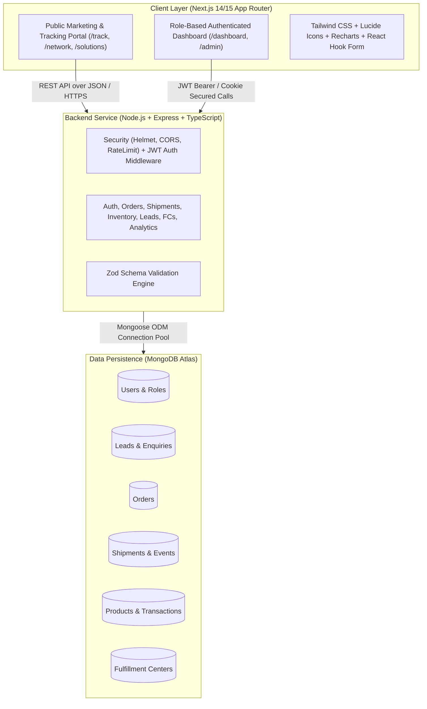

# WareIQ Interactive Fulfillment & Logistics Platform — System Architecture

**Developer**: Manoj Arja  
**Client Project**: WareIQ Interactive Platform  
**Target Delivery**: 05 October 2026  
**Architecture Paradigm**: Decoupled Full-Stack Monorepo (Next.js App Router + Express.js REST API + MongoDB Atlas)

---

## 1. High-Level System Architecture



---

## 2. Directory & Repository Structure

```
wareiq-platform/
├── docs/
│   ├── ARCHITECTURE.md          # Complete system architectural specification
│   ├── WEBSITE_ANALYSIS.md      # Official WareIQ positioning & public domain analysis
│   └── DATABASE_SCHEMA.md       # Entity-relationship & schema models
├── frontend/                    # Next.js 14+ (App Router, TypeScript, Tailwind CSS)
│   ├── app/
│   │   ├── (auth)/login/        # Customer & Admin Authentication
│   │   ├── (public)/            # Public Corporate Website
│   │   │   ├── page.tsx         # Homepage with real WareIQ value propositions
│   │   │   ├── solutions/       # D2C, B2B, Q-Commerce, Marketplace, Shipping, SOR
│   │   │   ├── network/         # Interactive Pan-India Fulfillment Network Map & List
│   │   │   ├── track/           # Live Shipment & Order Tracking Timeline
│   │   │   ├── services/        # Service Explorer with interactive cards
│   │   │   ├── shipping/        # Multi-carrier shipping engine overview
│   │   │   ├── industries/      # Industry verticals (Beauty, Fashion, Tech, etc.)
│   │   │   └── contact/         # Multi-step Enterprise Demo / Lead capture
│   │   ├── dashboard/           # Customer Fulfillment Operations Portal
│   │   │   ├── page.tsx         # Executive KPI & Shipment Overview
│   │   │   ├── orders/          # Orders table, filters, status, detail view
│   │   │   ├── inventory/       # Stock tracking, low-stock alerts, adjustments
│   │   │   ├── fulfillment-centers/ # Network node visibility & capacities
│   │   │   └── analytics/       # Recharts operational & delivery performance
│   │   └── admin/               # Internal Operations & Admin Control
│   │       ├── page.tsx         # Admin Command Center
│   │       ├── leads/           # Enterprise Lead/Enquiry pipeline (CRM)
│   │       ├── users/           # User access management & role assignments
│   │       └── orders/          # Demo order injection & AWB event simulator
│   ├── components/              # Reusable UI component library (Nav, Tables, Badges, Modals)
│   ├── lib/                     # API client, utility functions, formatting
│   ├── types/                   # Shared TypeScript interfaces & types
│   └── public/                  # Static assets & brand graphics
├── backend/                     # Node.js + Express + TypeScript REST API
│   ├── src/
│   │   ├── config/              # MongoDB connection, env configs
│   │   ├── controllers/         # Business logic handlers
│   │   ├── middleware/          # JWT verify, role guard, error handler, rate limit
│   │   ├── models/              # Mongoose schemas (User, Lead, Order, Shipment, Product, FC, Transaction)
│   │   ├── routes/              # Express API route modules
│   │   ├── seeds/               # Realistic enterprise seed data generator
│   │   ├── utils/               # Response wrapper, logger, pagination helpers
│   │   ├── validators/          # Zod validation schemas
│   │   ├── app.ts               # Express application configuration
│   │   └── server.ts            # Server bootstrapper & database initialization
│   ├── tests/                   # API & integration test suite
│   ├── tsconfig.json
│   └── package.json
├── .gitignore
├── .env.example
└── README.md
```

---

## 3. Security, Performance & Scalability Protocols
1. **Password Security**: Salts and hashes with `bcryptjs` (work factor 10+).
2. **Access Control**: Role-Based Access Control (`admin`, `operations`, `customer`).
3. **API Protection**: Helmet HTTP headers, strict CORS whitelisting, centralized standard error responses.
4. **Validation**: Strict schema validation with Zod on both client and server.
5. **Data Segregation**: Clear delineation between factual public WareIQ data and synthetic demonstration data.
