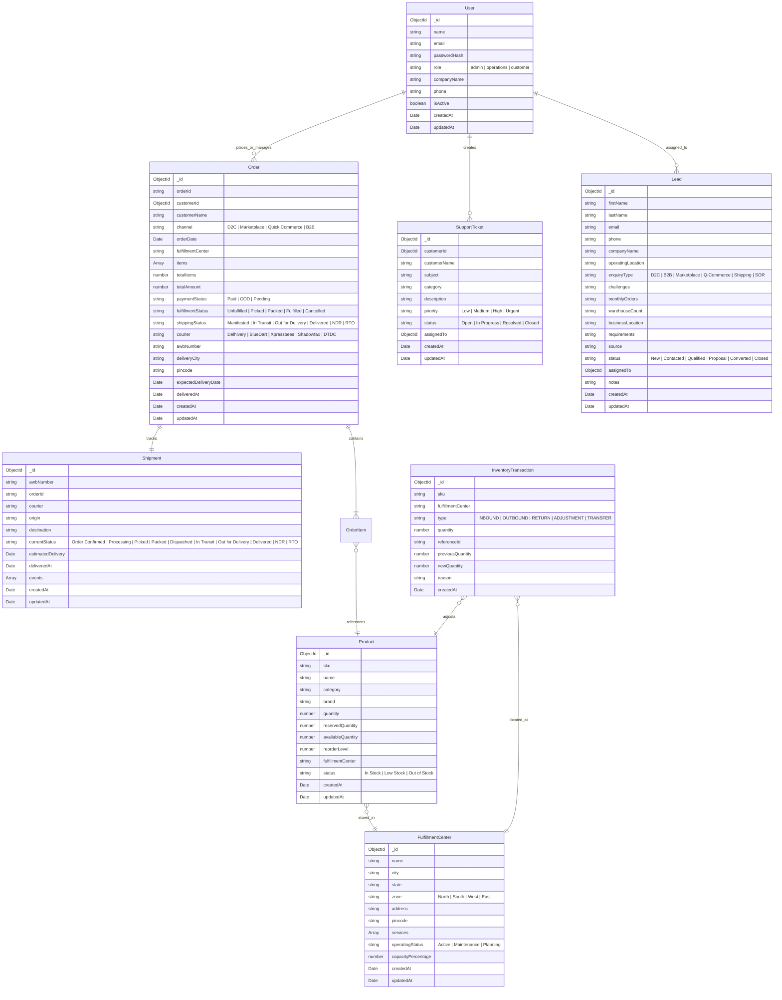

# MongoDB Atlas Database Schema & Entity Relationships

This document outlines the data models designed for the **WareIQ Interactive Fulfillment Platform**.

---

## 1. Entity Relationship Diagram

